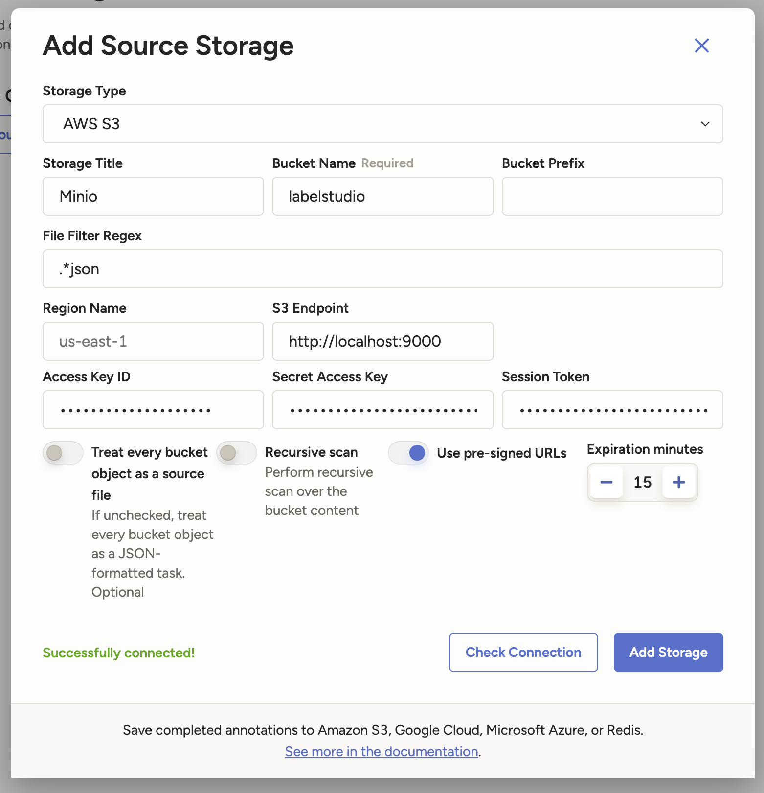

# 🚀 ZenML Machine Learning Platform Demo

Welcome to our demo setup for a Machine Learning Platform built with [ZenML](https://zenml.io/)🧘.
In this demonstration, we will tackle the classic Titanic problem, where our goal is to predict the 
survival of passengers aboard the Titanic based on various features such as age, sex, ticket class, 
and other factors. This dataset is famously used in machine learning due to its rich set of features
and the clear binary classification task it presents.

Throughout this guide, we will walk through the entire machine learning pipeline from data 
annotation with Label Studio, where we will label the data for training, to model training with 
`sklearn RandomForest`. Additionally, we will utilize MLflow for experiment tracking and managing 
our model registry to keep track of our model versions and metrics. 
Finally, we will deploy the trained model with BentoML. 
The provided components and services will support every stage of the lifecycle, ensuring a 
comprehensive understanding of how to build and deploy a machine learning model using ZenML.

## 🚧 Environment Setup

Before you begin, ensure you have Docker and Docker Compose installed. The following components are
defined in the `docker-compose.yml` file:

- **MySQL**: Serves as the backend database 🗄️
- **Registry**: Container registry for Docker images 🐳
- **Label Studio**: Tool for data annotation 🏷️
- **MinIO**: S3-compatible object storage for artifacts 📦
- **ZenML**: The core piece of our pipeline for orchestration and management 👑
- **MLflow**: For logging models and experiments 📊
- **Feast**: Feature Store for managing features for model data ✨
- **PostgresQL**: As an offline store and registration for our FeatureStore 🗄️
- **BentoML**: For deployment of the model 🚢
  
## 🛠️ Installation

To start the services, run the following command:

```bash
docker-compose up -d
```
## 🛠️ Development Environment Setup

In this section, we will set up our development environment.

### **Optional: Code Server**
You have the option to use a Code Server, which provides a web-based development environment that
allows you to work on your Python code from any browser. You can access the Code Server 
instance at [http://localhost:8443](http://localhost:8443). If you choose to use the Code Server, 
ensure it is up and running before proceeding.

### **Optional: Installing Python Extension in Code Server**
Oopen the Code Server and install the Python extension. This extension will provide syntax 
highlighting, code completion, and other essential features for your Python development. 
You can typically find the extension marketplace in the sidebar of the Code Server interface.

### **Using Rye for Dependency Management**
Next, we will utilize **Rye**, a package and dependency manager that simplifies the creation of 
Python environments. It helps us manage our packages and dependencies in a more streamlined manner.
To create the virtual environment and install necessary dependencies, run the following 
command:

```bash 
rye sync
 ```
This command will set up the virtual environment based on the project's 
requirements.

### **Activating the Virtual Environment**
After running the `rye sync` command, you need to activate the virtual environment. 
To do this, enter the following command: 

```bash
source .venv/bin/activate
```
### **Testing Your Setup**
Once the virtual environment is activated, you can verify that ZenML is correctly installed 
by checking its version with: 
```bash
zenml --version`
```

If you see the version number, you are all set to proceed with the next steps in the demo!

## 🔗 Connecting to the ZenML Server

In this section, we will establish a connection to the ZenML server.

### **Opening the ZenML Dashboard**
First, open the ZenML dashboard by navigating to [http://localhost:8080](http://localhost:8080) 
in your web browser. This will allow you to go through the initial setup process by clicking through
the setup wizard.

### **Logging in via ZenML CLI**
Next, switch to the terminal and use the ZenML CLI to log in to the server. Run the following 
command:

```bash 
zenml login --url http://localhost:8080
```

This command will prompt you to authenticate via your browser. Follow the on-screen instructions 
to log in.

### **Creating a ZenML Service Account**
After logging in, you can create a ZenML service account. This will generate an API key for you. 
Make sure to store this API key securely, as you will need it to connect via the CLI.

### **Updating the .env File**
Once you have your API key, open your `.env` file and add the following line with the API key:

`ZENML_API_KEY=<your_api_key>`

Replace `<your_api_key>` with the actual API key you generated.

### **Connecting Again Using the API Key**
To connect to the ZenML server using the API key, run the following command in the terminal:

```bash
zenml login --url http://localhost:8080 --api-key
```
You will be prompted to enter the API key. Input the key you added to your `.env` file. 
After completing this step, you will be fully connected to the ZenML server!

## 🌟 Demo Walkthrough

In this section, we will perform the actual demo, focusing on different stages of the machine 
learning pipeline, starting from data annotation.

### 🛠️ Configuring MinIO Access Key

Before we can start importing tasks into Label Studio, and to ensure proper functioning of ZenML 
and MLflow, we need to create an Access Key in MinIO and add it to the `.env` file.

#### **Opening the MinIO Web Console**
1. Open your web browser and navigate to the MinIO dashboard at [http://localhost:9001](http://localhost:9001).
2. Log in using the credentials defined in the `.env`.

#### **Creating an Access Key**
1. Once you are logged in to the MinIO dashboard, navigate to the **Users** section.
2. Click on **Access Keys** to open the Access Keys section.
3. Then click on `Create access key` and then on `Create to create a new access key.

#### **Updating the .env File**
1. Open your `.env` file in your project directory.
2. Add or update the following lines with the Access Key and Secret Key you created:

```
AWS_ACCESS_KEY_ID=<your_access_key>
AWS_SECRET_ACCESS_KEY=<your_secret_key>
```
Replace `<your_access_key>` and `<your_secret_key>` with the actual keys you generated in the MinIO console.

By configuring the Access Key and Secret Key in the `.env` file, you ensure that your application 
can authenticate with MinIO successfully. 

### 📊 Data Annotation with Label Studio

Data annotation is a critical step in the machine learning lifecycle, as it involves labeling the 
data used to train our models. In our demo, we will use **Label Studio**, a web-based tool designed 
for data labeling tasks.

#### **Creating a New Project**
1. Open Label Studio in your browser by navigating to [http://localhost:8081](http://localhost:8081).
2. Once you are on the Label Studio interface, click on "Create Project" to start a new annotation project based on the Titanic dataset.
3. Provide a descriptive name and instructions for the annotators, detailing what needs to be labeled.

#### **Configuring the Annotation Interface**
Next, you need to set up the labeling interface. Define the labeling configuration to specify what 
features from the dataset need annotation. Search under `./config` for the file `label-view.html`. 
This file contains the label template for our data. 

#### **Importing Labeling Tasks**
1. Navigate to the project you just created in Label Studio and select the option to import data.
2. Load the labeling tasks from MinIO, ensuring that the import settings match the format of the tasks we have stored there.

3. Complete the import process to make the tasks available for review.

**Note:** While our current demo focuses on importing data, it's worth mentioning that you have the 
option to perform labeling within Label Studio if needed, which can enhance the dataset further.

#### **Updating the .env File with User Access Token**
After setting up your Label Studio project, you will need to configure the User Access Token for authentication:
1. Open the Label Studio interface and navigate to the **Account & Settings** (user icon).
2. Locate your Access Token, which is required for secure API calls.
3. Open your `.env` file in your project directory.
4. Add or update the following line, replacing `<your_access_token>` with the actual token you retrieved:

```
LABEL_STUDIO_ACCESS_KEY=<your_access_token>
```

### 🧩 Registering ZenML Components

In this section, we will register the necessary components for our ZenML pipeline. 
Each command below serves to configure different aspects of our ML workflow.


#### **1. Registering the Artifact Store**
We first register an artifact store in MinIO to handle the storage of our ML artifacts and outputs 
from the pipeline runs. This points ZenML to our MinIO instance.

```bash
zenml integration install -y s3
zenml secret create minio_secret --aws_access_key_id=${AWS_ACCESS_KEY_ID} --aws_secret_access_key=${AWS_SECRET_ACCESS_KEY}
zenml artifact-store register minio_store -f s3 --path='s3://zenml' --authentication_secret=minio_secret --client_kwargs='{"endpoint_url": "http://localhost:9000", "region_name": "eu-east-1"}'
```

#### **2. Registering the Container Registry**
This command registers a local Docker registry where our Docker images will be stored. 
It enables ZenML to pull and push Docker images efficiently.

```bash
zenml container-registry register local-docker-registry --flavor=default --uri=localhost:5000
```

#### **3. Registering the MLflow Experiment Tracker**
Here, we register MLflow as our experiment tracker. This component will log metrics, parameters, 
and model artifacts. Username and passwords are required dummy credentials. 

```bash
zenml experiment-tracker register MLflow --flavor=MLflow --tracking_uri=http://localhost:5001 --tracking_username="admin" --tracking_password="password"
```

#### **4. Registering the Feature Store for Feast**
We will register Feast as our feature store, which will help us manage and serve features for our models.

```bash
zenml feature-store register feast_store --flavor=feast --feast_repo="./src/titanicsurvivors/feature_repo"
```

#### **5. Registering the Model Registry for MLflow**
This command registers MLflow as our model registry, which keeps track of different versions of our 
trained models.

```bash
zenml model-registry register MLflow_model_registry --flavor=MLflow
```

#### **6. Registering the Annotator for Label Studio**
We also need to register Label Studio as our annotator, enabling seamless integration for retrieving
labeled data.

```bash
zenml secret create label_studio_secrets --api_key=${LABEL_STUDIO_ACCESS_KEY}  
zenml annotator register label_studio --flavor label_studio --authentication_secret=label_studio_secrets --instance_url="http://localhost" --port=8081
```

#### **7. Registering the BentoML Deployment**
Finally, we will register BentoML as our model deployment tool, allowing us to serve models as APIs easily.

```bash
zenml model-deployer register bentoml_deployer --flavor=bentoml
```

By running these commands, you will set up a robust infrastructure using ZenML that supports
efficient data handling, model training, and deployment for your machine learning projects.


## 🛠️ Creating a New ZenML Stack

In this section, we will create a new stack in the ZenML Dashboard. A stack in ZenML is a 
combination of various components that work together for a specific machine learning workflow.

### **Creating the Stack**
1. Open the ZenML Dashboard by navigating to [http://localhost:8080](http://localhost:8080) in your web browser.
2. Once you’re logged in, look for the **Stacks** section in the main navigation menu.
3. Click on the **New Stack** button to start the stack creation process.
4. Choose the **Manual Setup**.
5. Enter the name `demo-stack` for your new stack.
6. You will be prompted to select the various components that were registered earlier. Choose the following:
   - **Artifact Store**: Select `minio_store`
   - **Container Registry**: Select `local-docker-registry`
   - **Experiment Tracker**: Select `mlflow`
   - **Feature Store**: Select `feast_store`
   - **Model Registry**: Select `mlflow_model_registry`
   - **Annotator**: Select `label_studio`
   - **Model Deployer**: Select `bentoml_deployer`
7. After selecting all the necessary components, click on the **Register Stack** button to finalize
the stack creation.

### **Verifying the Stack**
Once you create the stack, you should see `demo-stack` listed in the Stacks section of the ZenML 
Dashboard. 

With the stack successfully created, you are now ready to activate it in the ZenML CLI and proceed 
with your ML workflow!

To activate the recently created stack call the following command in yout terminal:

```bash
zenml stack set demo-stack
```

### 🚀 Running the Label Studio Data Import Pipeline

In this section, we will execute the pipeline that imports the labeled data from Label Studio into 
our ML workflow. This will be done through the terminal by calling a Python script.

#### **Executing the Pipeline**
1. Open your terminal in the Code Server or your preferred terminal interface.
2. Call the following command from the root directory of the project:

```bash
python src/titanicsurvivors/pipelines/preprocessing/labelstudio.py
```
This command will initiate the data import process, pulling the labeled data from Label Studio and 
preparing it for use in the subsequent steps of the machine learning pipeline.

#### **Verifying the Pipeline Execution**
After the pipeline has successfully run, you can verify its execution and results in the ZenML Dashboard:

1. Open the ZenML Dashboard by navigating to [http://localhost:8080](http://localhost:8080) in your web browser.
2. In the dashboard, go to the **Pipelines** section where you should see a list of executed pipelines, including the one you just ran for importing the Label Studio data.
3. Click on the relevant pipeline and the latest run to view its details.

#### **Exploring the Pipeline Run Details**
Once you are in the pipeline run view, you can familiarize yourself with the following components:
- **Steps**: Review each step in the pipeline to understand the sequence of operations performed.
- **Artifacts**: Examine the artifacts produced during the pipeline execution. Artifacts can include datasets, models, and logs that were generated.
- **Configurations**: Take a look at the configurations utilized in the pipeline run.

### 🚀 Running the Data Subset Creation Pipeline

In this section, we will execute a pipeline that takes the imported data from Label Studio and 
splits it into training and testing subsets. This process ensures that we have separate datasets 
for model training and evaluation.

#### **Adjusting the Configuration**
Before running the pipeline, we need to update the configuration file to specify the correct 
artifact name:
1. Navigate to the configuration file located at `configs/create_subsets.yaml`.
2. Open the file in your preferred text editor.
3. Locate the parameter `data_artifact_name` and change its value to `data_artifact_name: data_w_features_label_studio`
4. Save the changes to the configuration file.

#### **Executing the Pipeline**
After adjusting the configuration, we can now proceed to run the pipeline:
1. Open your terminal in the Code Server or your preferred terminal interface.
2. Execute the dataset creation script by running:
```bash
 python src/titanicsurvivors/pipelines/training/datasets.py
```
This command will initiate the process of splitting the data into training and testing subsets b
ased on the configuration you just updated.

#### **Verifying the Pipeline Execution**
Once the pipeline has successfully run, you can check the output to ensure the subsets were created 
correctly. Look for logs in your terminal that confirm the successful execution of the data 
splitting process.

### 🚀 Training the Random Forest Model

In this section, we will train a Random Forest model using the previously prepared training subsets. This will be done by executing a Python script located in our project directory.

#### **Executing the Random Forest Training Script**
1. Open your terminal in the project root directory (if you aren’t already there).
2. Execute the Random Forest training script by running the following command:
```bash
python src/titanicsurvivors/pipelines/training/randomforest.py
```
This command will initiate the training of the Random Forest model, using the data subsets created 
in the previous steps.

#### **Verifying Results in MLflow**
Once the training is completed successfully, you can review the results in the MLflow Tracking UI:
1. Open your web browser and navigate to the MLflow UI at [http://localhost:5001](http://localhost:5001).
2. In the MLflow UI, locate the experiment named `Train RandomForest Classifier`. This is where 
all metrics, parameters, and artifacts related to the training runs of your Random Forest model are 
logged.

### ✨ Using the Feature Store

In this step, we will make use of Feast to manage our features effectively. 
The goal is to import the data into a database, define our features, and prepare them for later 
retrieval during model training.

#### **Step 1: Importing Data into the Database**
Before we can utilize the feature definitions and apply them, we need to ensure our data is
available in the Offline Store of the Feature Store. To do this, we first execute the pipeline
that imports data into the database.

```bash
python src/titanicsurvivors/pipelines/preprocessing/database.py
```
This pipeline will transfer the relevant data into the database that Feast will use for its 
Offline Store.

#### **Step 2: Understanding the Feature Definition**
The `features.py` file located in the `src/titanicsurvivors/feature_repo` directory contains the 
definitions for our features and how they should be structured within the Feast framework. 
Below is a brief overview of what happens in this file:

1. **Project Creation**: A Feast project named `titanicsurvivors` is created, which serves as a container for all related features and entities.

2. **Entity Definition**: An entity representing a Titanic passenger is defined, linking it to `PassengerId`. This entity will be used to join the feature data.

3. **Data Source Configuration**: A PostgreSQL source is set up with a query to retrieve all data from the `titanic` table, which forms the basis of our features.

4. **Feature View Creation**: A `FeatureView` is defined using the entity and data source, specifying the schema of features like ticket class, age, sex, and other relevant attributes for our model.

5. **On-Demand Feature View**: An on-demand feature view, `additional_and_grouped_features`, is defined, which calculates extra features on-demand based on the input data.

6. **Feature Service**: Finally, a `FeatureService` named `titanic_classifier` is created, encapsulating the main feature view and the additional features for retrieval.

#### **Step 3: Applying the Feature Definitions**
Now that we have our feature definitions set up and our database populated with the relevant data, 
we need to apply these definitions to create the necessary tables and structures in the database:

1. Open your terminal and navigate to the feature repository directory:
```bash
cd src/titanicsurvivors/feature_repo
```
2. Execute the `feast apply` command.

This command will take the feature definitions from `features.py` and create the necessary 
structures in the database, ensuring that our features are properly materialized and ready for 
use in the machine learning pipeline.

#### **Step 4: Feature Store Pipeline Execution**
After importing the data and applying the feature definitions to the feature store, we need to run 
the pipeline that fetches the historical features of the feature store and makes it available as an 
artifact in ZenML.
```bash
python src/titanicsurvivors/pipelines/preprocessing/featurestore.py
```

#### **Step 5: Adjusting the Configuration for Subsets**
Next, we will need to update the configuration file for creating training and testing subsets:
1. Navigate to the configuration file located at `configs/create_subsets.yaml`.
2. Open the file in your preferred text editor.
3. Locate the parameter `data_artifact_name` and change its value to `data_artifact_name: data_w_features_feature_store`.
4. Save the changes to the configuration file.

#### **Step 6: Executing the Data Subset Creation Pipeline**
After adjusting the configuration, we can now proceed to run the pipeline that creates the subsets 
again:
1. Make sure you are in the root directory of your project.
2. Execute the dataset creation script by running:

```bash
python src/titanicsurvivors/pipelines/training/datasets.py
```
### **Step 5: Training the Random Forest Model Again**
With the new subsets prepared, we can retrain the Random Forest model:
```bash
python src/titanicsurvivors/pipelines/training/randomforest.py
```

### 🚀 Deploying the Random Forest Model as a Bento Service

In this final step of the demo, we will deploy the trained Random Forest model using BentoML. 
This will allow us to serve the model as an API endpoint for making predictions.

#### **Step 1: Executing the Bento Service Deployment Pipeline**
1. Open your terminal in the project root directory (if you aren’t already there).
2. Execute the Bento service deployment script by running:

```bash
python src/titanicsurvivors/pipelines/deployment/bento.py
```
This command will package the trained model and deploy it as a Bento service.

#### **Step 2: Accessing the Bento Service**
Once the deployment process is completed, you can access the Bento service in your web browser 
at [http://localhost:3000](http://localhost:3000).

#### **Step 3: Testing the Predict API**
To test the model's prediction capabilities, navigate to the Predict API section of the Bento 
service. You will be required to send a request with test data. Use the following sample 
JSON data for the prediction:
```json
{
   "Age": 29.0,
   "Deck_0": 1.0,
   "Deck_1": 0.0,
   "Deck_2": 0.0,
   "Deck_3": 0.0,
   "Embarked_0": 1.0,
   "Embarked_1": 0.0,
   "Embarked_2": 0.0,
   "Family_Size_Grouped_0": 0.0,
   "Family_Size_Grouped_1": 0.0,
   "Family_Size_Grouped_2": 1.0,
   "Fare": 100,
   "Parch": 1,
   "Pclass_1": 1.0,
   "Pclass_2": 0.0,
   "Pclass_3": 0.0,
   "Sex_0": 1.0,
   "Sex_1": 0.0,
   "SibSp": 0,
   "Ticket_Frequency": 2,
   "Title_0": 1.0,
   "Title_1": 0.0,
   "Title_2": 0.0,
   "Title_3": 0.0,
   "is_married": 1
}
```
#### **Step 4: Reviewing the Prediction Results**
Check the response from the API to see the predicted survival outcome based on the given input data.

Congratulations! You have completed the demo by deploying your trained model and testing its 
predictions through a live API endpoint. 🎉

