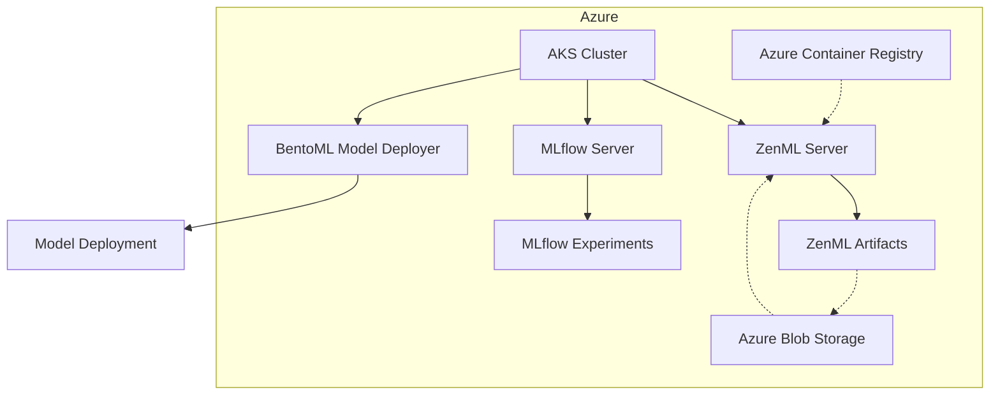

# 🚀 ZenML Machine Learning Platform Demo on Azure
Welcome to our demo setup for a Machine Learning Platform built with ZenML🧘.
In this exercise, we will tackle the classic Titanic problem, where our goal is to predict the
survival of passengers aboard the Titanic based on various features such as age, sex, ticket class,
and other factors. This dataset is famously used in machine learning due to its rich set of features
and the clear binary classification task it presents.

Throughout this guide, we will walk through the entire machine learning pipeline from data preparation and feature engineering to model training with
xgboost. Additionally, we will utilize MLflow for experiment tracking and managing our model registry to keep track of our model versions and metrics.
Finally, we will deploy the trained model with BentoML.
The provided components and services will support every stage of the lifecycle, ensuring a
comprehensive understanding of how to build and deploy a machine learning model using ZenML.

## Objective
In this exercise you will go through the essential steps needed to start, develop, and deploy a machine learning project. 
By assigning specific roles such as Data Scientist, Platform Engineer, and ML Engineer, you will gain practical 
experience by solving interactive tasks that mimic real-world scenarios. The aim is to deepen and expand knowledge and 
skills in machine learning, experiment tracking, feature management, and model deployment using a Machine Learning Platform
build with ZenML.

## 🛠️ Setup / Stack Description
In this exercise, we utilize a setup provided on Azure, encompassing various components. 
Here is an overview of the components used:


* AKS Cluster (Azure Kubernetes Service): The central orchestrator, where the ZenML Server and the MLflow Server are operated.
* ZenML Server: The core of our ML orchestration and management platform.
* MLflow Server: For logging experiments and managing the model registry.
* BentoML Model Deployer: Used for the deployment of the trained models.
* Azure Blob Storage: Used as the ZenML Artifact Store and for the Mlflow artifacts.
* Azure Container Registry: Used as the Container Registry for ZenML.

## 🚧 Environment Setup
Before you begin, ensure you have Docker installed if you choose to use the Code Server. 
If you prefer to use your own IDE, ensure you have uv installed for dependency management.

### 🛠️ Installation
To start the Code Server service, run the following command:

```bash
docker-compose up -d
```
You can access the Code Server instance at http://localhost:8443.

#### Optional: Installing Python Extension in Code Server
Open the Code Server and install the Python extension. This extension provides syntax highlighting, code completion, 
and other essential features for your Python development. 
You can typically find the extension marketplace in the sidebar of the Code Server interface.

#### Using UV for Dependency Management (If you use your own IDE)
We will utilize uv, a package and dependency manager that simplifies the creation of Python environments. 
It helps manage packages and dependencies in a streamlined manner. 

To install uv please see the following [link](https://docs.astral.sh/uv/getting-started/installation/).


To create the virtual environment and install 
necessary dependencies, run the following command:

```bash
uv sync --all-extras
uv pip install -e . 
```
This command will set up the virtual environment based on the project requirements.

#### Activating the Virtual Environment (If you use your own IDE)
After running the uv sync command, activate the virtual environment using the following command:
```bash
source .venv/bin/activate
```
#### Add an environment variable
Please add a `.env` file to the root of the project folder. In this file please insert the following line and replace
`<group_name>` with your group name.
```dotenv
GROUP_NAME=<group_name>
```

#### Testing Your Setup
Once the virtual environment is activated, verify that ZenML is correctly installed by checking its version with:

```bash
zenml --version
```
If you see the version number, you are all set to proceed with the next steps in the demo!

### 🔌 Connect to the ZenML Server
For all further steps, you must connect to the ZenML server. You can do this with the following command. 
Make sure that you have previously logged in to the ZenML server with your user. 

```bash
zenml login <ZENML_SERVER_URI>
```

## 🫵 Steps of the exercise
In this role-play, you will be divided into three groups, each taking on a specific role within the machine 
learning project: Data Scientists, Platform Engineers, and ML Engineers.

### Role: Data Scientist
As a Data Scientist, your main tasks are to establish the training and validation of a xgboost model and using MLflow for experiment tracking. 
These steps are crucial to ensure that your model is both accurate and reliable, and that all experiments are tracked effectively for reproducibility.


#### Prepare the model training
First, you need to provide the data to be used for feature engineering and training as a ZenML artifact. 
There is already a pipeline that you can use for this. Simply execute the following command from the root 
directory of the project.

```bash
python src/titanicsurvivors/pipelines/prepare_raw_data.py
```

Once the raw data is available as an artifact in ZenML, this artifact can be used to perform feature engineering. 
Various methods are used to clean up the data and add other useful features that can help to create a better model. 
There is also an existing pipeline for this. 
Take a look at the code if you are interested in how feature engineering is carried out. The individual methods can be 
found under `src/titanicsurvivors/steps/feature_engineering`. 

You can also run the pipeline from the project root directory with the following command. 

```bash
python src/titanicsurvivors/pipelines/feature_engineering.py
```

Now everything is ready to start training the model. 

#### Training the XGBoost Model

First, take a look at the training pipeline. You can find it under 
`src/titanicsurvivors/pipelines/train_xgb_classifier.py`. In the second line of the pipeline function, you will see 
that we want to use the ZenML client to retrieve the artifact with the training data. 
We can do this by entering a name. The name of the artifact is `combined_features`.  
Please add the name of the artifact in the code.

Now we need to implement the actual training. To do this, please open the file `src/titanicsurvivors/steps/training.py` 
in which the function / step `train_xgb_classifier` can be found. 
First activate autologging for mlflow. You can do this with the following call.

```python
import mlflow
mlflow.autolog()
```
Now please add the following code to the step so that a training can be done. 

```python
dtrain = xgb.DMatrix(inputs, label=targets)
params = {
    "max_depth": max_depth,
    "eta": eta,
    "objective": objective,
    "eval_metric": eval_metric,
}
cv_results = xgb.cv(
    params=params,
    dtrain=dtrain,
    num_boost_round=1000,
    nfold=5,
    metrics=["error"],
    early_stopping_rounds=10,
    stratified=True,
)

best_iteration = cv_results["test-error-mean"].idxmin()
best_model = xgb.train(params, dtrain, num_boost_round=best_iteration + 1)
return best_model
```

Last but not least, we want to make the created model available as an artifact. 
To do this, the type of the return value of the function must be adapted. 
Please adjust the type of the return value so that it looks like this.

```python 
@step
def train_xgb_classifier(
    ...
) -> Annotated[
    xgb.Booster, "xgb_model_{os.getenv(‘GROUP_NAME’, ‘Default’)}"
]: 
...
```
#### Validate the model 

Last but not least, we want to collect metrics that can tell us how good the model is. 
For this purpose, the `validate_xgb_model` step must be adapted. This can be found in the file 
`src/titanicsurvivors/steps/validation.py`. 
Please insert the following content in the correct place. 

```python
from sklearn.metrics import accuracy_score, precision_score, recall_score, f1_score

accuracy = accuracy_score(targets, predictions)
precision = precision_score(targets, predictions)
recall = recall_score(targets, predictions)
f1 = f1_score(targets, predictions)
```

Finally, you can now runt the training by executing the following command.

```bash
python src/titanicsurvivors/pipelines/train_xgb_classifier.py
```

### Role: Platform Engineer
As a Platform Engineer, you will be responsible for registering the stack components with the ZenML Server. 
This includes the Orchestrator, Container Registry, Artifact Store, and MLflow as our Experiment Tracker. 
These components are fundamental for orchestrating, managing, and tracking the machine learning workflows and assets.

> [!IMPORTANT]  
> Please remember to always replace the group name in the following commands (<group_name>).

#### Registering ZenML Components
Ensure you have access to the ZenML server and establish a connection. This step is crucial for interacting with the 
ZenML Server and configuring stack components.

#### Registering the Orchestrator
Register the Azure Kubernetes Service (AKS) as the Orchestrator. 
This service will coordinate and manage the execution of your machine learning pipelines.

```bash
zenml orchestrator register azure_kubernetes_<group_name>  --flavor kubernetes             
```

```bash
zenml orchestrator connect azure_kubernetes_<group_name>  --connector azure-service-principal
```

#### Registering the Container Registry
Register the Azure Container Registry to manage Docker images. This registry will store and facilitate the efficient 
use of Docker images required for pipeline steps if using a remote orchestrator like kubernetes.

```bash
zenml container-registry register azure_container_registry_<group_name> -f azure --uri=mlopswszenmlcontainerregistry.azurecr.io
```

```bash
zenml container-registry connect azure_container_registry_<group_name> --connector azure-service-principal
```

### Registering the Artifact Store
Register the Azure Blob Storage as the Artifact Store. This storage will handle all artifacts produced during pipeline 
runs, such as datasets, models, and logs.

```bash
zenml artifact-store register azure_store_<group_name> -f azure --path=az://mlopsws-zenmlartifactstore 
```

```bash
zenml artifact-store connect azure_store_<group_name> --connector azure-service-principal
```

#### Registering the MLflow Experiment Tracker
Register MLflow as the Experiment Tracker. MLflow will log metrics, parameters, and artifacts, and help in 
tracking the various experiments conducted.

First we have to create a secret in ZenML, which is used to authenticate with the MLflow server.

```bash
zenml secret create mlflow_secret_<group_name> --username=<username> --password=<password>
```

Now we can use this secret to add the MLflow server. 

```bash
zenml experiment-tracker register mlflow_<group_name> --flavor=mlflow --tracking_username={{mlflow_secret_<group_name>.username}} --tracking_password={{mlflow_secret_<group_name>.password}} --tracking_uri=<tracking_uri>
```

#### Creating the ZenML Stack
Combine the registered components into a stack. This stack will define the infrastructure setup for executing 
and managing machine learning workflows.

```bash
zenml stack register -a azure_store_<group_name> -o default -c azure_container_registry_<group_name> -e mlflow_<group_name> azure_<group_name>

```
#### Setting the Active ZenML Stack
Activating the stack is essential to ensure that the components registered are correctly configured and ready 
for use in your ZenML pipelines.

```bash
zenml stack set azure_<group_name>
```

To check if everything looks good please run the following command. 

```bash
zenml stack describe
```

### Role: ML Engineer
As an ML Engineer, your responsibility is to create a pipeline to deploy the trained model using BentoML. 
Deployment ensures that the trained model is accessible for inference and can be integrated into production systems.

#### Register Bento Model Deployer
Please execute the following command to create a model deployer stack component (change group name).

```bash
zenml model-deployer register bentoml_deployer_<group_name> --flavor=bentoml
```

#### Creating the Bento Service
First, a service must be created that will be used by Bento to process the requests for a prediction. 
This service must be stored in a Python file located right next to the deployment pipeline. 
Please create the file `src/titanicsurvivors/pipelines/deploy/service.py`. 

The content of the file must be as follows. Make sure that the name of the model to be loaded matches the model name 
that you define in the Bento deployment. 

```python
from typing import List

import bentoml
import numpy as np
import pandas as pd
import xgboost as xgb


@bentoml.service(
    name="TitanicService",
)
class TitanicService:
    def __init__(self):
        self.model = bentoml.xgboost.load_model("titanic-classifier")

    @bentoml.api()
    async def predict(self, inputs: List[dict]) -> List[str]:
        dinput = xgb.DMatrix(pd.DataFrame(inputs))
        output_tensor = self.model.predict(dinput)
        print(output_tensor)

        return np.where(
            np.array([round(output) for output in output_tensor]) == 1,
            "Survived",
            "Died",
        ).tolist()
```
#### Create the deployment pipeline 
Now we need to create the deployment pipeline. This is located in the file 
`src/titanicsurvivors/pipelines/deploy/deploy_xgboost.py`. First get the current model artifact. 
You can obtain the name of the artifact from your data scientist.
The name of the artifact must appear in the method call ` f“<artifact_name>_{os.getenv(‘GROUP_NAME’, ‘Default’)}”`

The next small step is to give the bento you are creating a model name. This name must match the model name from the service.

The following code creates an InProcess Server that provides an endpoint that you can use for inferences. 

```python
from zenml.integrations.bentoml.steps import (
    bentoml_model_deployer_step,
)
bentoml_model_deployer_step(
        bento=bento,
        model_name="<model_name>",  # Name of the model
        port=3001,  # Port to be used by the http server
    )
```

## 🧑‍🧑‍🧒 And now all together
Now let's combine your work and see if everything worked. 
First, the data scientist needs to become active. 

Please enter the following command in your terminal to activate the stack that your platform engineer created for you. 

```bash
zenml stack set azure_<group_name>
```
Now please run all pipelines again. 

```bash
python src/titanicsurvivors/pipelines/prepare_raw_data.py
```

```bash
python src/titanicsurvivors/pipelines/feature_engineering.py
```

```bash
python src/titanicsurvivors/pipelines/train_xgb_classifier.py
```
Since everything now runs via Docker and remote execution, these steps will take some time. 
During this time, familiarize yourself with the ZenML dashboard and the results in MLflow.

As soon as all pipelines have been run, the Machine Learning Engineer comes into play. 

First you have to create another stack to run the deployment pipeline. Please execute the following code (change your group name). 

```bash
zenml stack register -o default -a azure_store_<group_name> -d bentoml_deployer_<group_name> local_deploy_<group_name>

zenml stack set local_deploy_<group_name>
```

Please run the deployment pipeline yourself. Make sure that the name of the model artifact matches that 
of the training pipeline.

```bash
python src/titanicsurvivors/pipelines/deploy/deploy_xgboost.py
```

### Testing the Deployment
Access the Bento service in your web browser at http://localhost:3000 and test the Predict API using the provided JSON data. 
This will verify that the model is correctly deployed and capable of making predictions.
```json
{
   "Age": 2.0,
   "Deck_0": 1.0,
   "Deck_1": 0.0,
   "Deck_2": 0.0,
   "Deck_3": 0.0,
   "Embarked_0": 1.0,
   "Embarked_1": 0.0,
   "Embarked_2": 0.0,
   "Family_Size_Grouped_0": 0.0,
   "Family_Size_Grouped_1": 0.0,
   "Family_Size_Grouped_2": 1.0,
   "Fare": 2,
   "Parch": 1,
   "Pclass_1": 1.0,
   "Pclass_2": 0.0,
   "Pclass_3": 0.0,
   "Sex_0": 1.0,
   "Sex_1": 0.0,
   "SibSp": 0,
   "Ticket_Frequency": 2,
   "Title_0": 1.0,
   "Title_1": 0.0,
   "Title_2": 0.0,
   "Title_3": 0.0,
   "is_married": 1
}
```

Congratulations! You have successfully completed the tasks for your respective roles, working together to build 
and deploy a machine learning model using ZenML on Azure. 🎉
